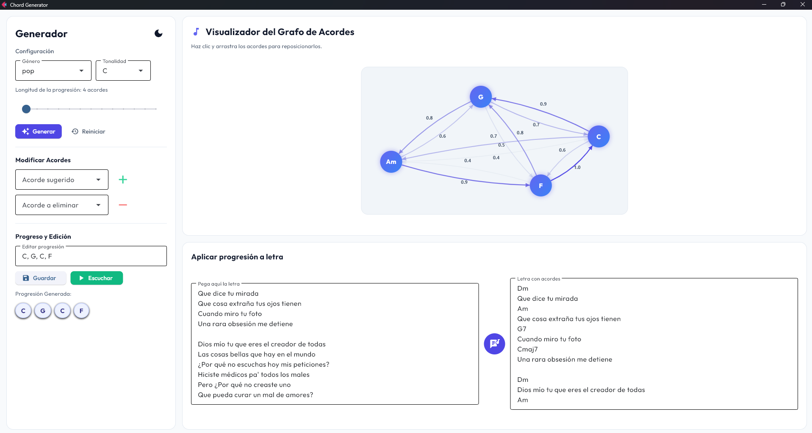

# Muse Buddy Chords

**Muse Buddy Chords** es una aplicación de escritorio interactiva construida en Python con **Flet** diseñada para músicos, compositores y estudiantes de teoría musical. Permite generar, visualizar, editar y escuchar progresiones de acordes basadas en reglas armónicas de la teoría musical y estilos específicos de géneros populares (Pop, Rock y Jazz).

La aplicación cuenta con una interfaz responsiva, soporte para temas claro/oscuro y un visualizador interactivo de grafos en tiempo real que permite arrastrar y reorganizar los nodos de forma fluida.


---

## Características Principales

### 1. Generación Armónica Basada en Grafos
- **Paseos aleatorios ponderados**: Utiliza un motor basado en `networkx` para realizar un recorrido de cadenas de Markov sobre un grafo dirigido de acordes, garantizando transiciones coherentes.
- **Perfiles por Géneros**: Carga grafos iniciales basados en estilos específicos (Pop, Rock, Jazz) desde archivos de datos serializados en JSON.
- **Transporte Dinámico**: Permite cambiar la tonalidad raíz, esto genera un nuevo grafo a partir de la tonalidad escogida.
- **Clasificación Teórica**: Clasifica los acordes sugeridos en tres categorías según la teoría musical:
  - **Acordes Diatónicos**: Los acordes naturales de la escala seleccionada.
  - **Préstamo Modal**: Acordes tomados prestados de modos paralelos.
  - **Dominantes Secundarias**: Acordes de tensión que resuelven hacia grados diatónicos.

### 2. Visualizador de Grafo Interactivo
- **Canvas interactivo**: Representación visual de los acordes y sus relaciones utilizando un lienzo de dibujo personalizado (`GestureDetector` y `Canvas` en Flet).
- **Interacción directa (Drag & Drop)**: Permite arrastrar y colocar cada acorde del grafo en cualquier posición del panel espacial para organizar visualmente el mapa de acordes.
- **Animaciones fluidas**: Micro-animaciones en el hover de los acordes y cálculo dinámico de conexiones.

### 3. Síntesis y Reproducción de Audio
- **Sintetizador Aditivo de Ondas**: Utiliza la librería `music21` para resolver las notas del acorde y sus frecuencias fundamentales, generando una onda de sonido senoidal aditiva con armónicos superiores.
- **Envolvente de Volumen ADSR**: Suaviza el inicio (Attack) y la caída (Fade Out) del sonido para evitar chasquidos de saturación y generar una sensación auditiva orgánica y fluida.
- **Reproducción Asíncrona**: Escribe temporalmente un búfer WAV dinámico y lo reproduce en segundo plano en Windows utilizando `winsound` sin congelar el hilo principal de la interfaz de usuario.

### 4. Edición de Grafo y Bypass de Acordes
- **Adición Dinámica**: Permite añadir nuevos acordes a la paleta disponible. El motor calcula y conecta automáticamente el acorde entrante con los nodos existentes usando reglas armónicas generales (`HARMONIC_RULES`) y específicas de estilo.
- **Eliminación y Bypass de Nodos**: Si eliminas un acorde del grafo, el sistema realiza un bypass inteligente conectando de forma directa a sus predecesores con sus sucesores (multiplicando sus pesos de transición) para rehacer el grafo y evitar nodos huérfanos.

### 5. Mapeador de Acordes a Letras (Lyric & Chord Mapper)
- **Alineación de Letras**: Panel interactivo donde se puede pegar la letra de una canción para sobreescribir y alinear automáticamente la progresión generada por encima del texto de la letra.
- **Reordenamiento visual**: Los acordes de la progresión se muestran como tarjetas interactivas que pueden ser reordenadas arrastrándolas con el ratón.

---

## Estructura del Código

El proyecto sigue la siguiente estructura:

```
mb chords/
├── app/
│   ├── constants.py            # Definiciones de constantes globales.
│   └── state.py                # AppState: Estado reactivo global de la aplicación.
├── audio/
│   └── player.py               # Síntesis aditiva WAV y reproducción mediante winsound.
├── controllers/
│   └── chord_controller.py      # Controlador MVC que conecta la lógica con los componentes visuales.
├── core/
│   ├── chord_theory.py         # Reglas armónicas, intervalos, conversión a números romanos y transporte.
│   ├── genre_loader.py         # Lector de esquemas de acordes iniciales en JSON.
│   ├── graph_engine.py         # Clase ChordGraph integrada con NetworkX y renderizado PyVis.
│   ├── graph_transforms.py      # Algoritmos de transformación de grafos (añadir/eliminar nodos, bypass).
│   └── progression_generator.py # Algoritmo de generación de progresiones por paseos aleatorios.
├── data/
│   ├── jazz.json               # Relaciones de acordes iniciales para Jazz.
│   ├── pop.json                # Relaciones de acordes iniciales para Pop.
│   └── rock.json               # Relaciones de acordes iniciales para Rock.
├── services/
│   ├── genre_service.py        # Mapeo y validación de modos para géneros musicales.
│   └── lyric_chord_mapper.py   # Algoritmo de inyección y formateo de acordes sobre la letra.
├── ui/
│   ├── components.py           # Componentes atómicos reutilizables (ej. tarjetas de acordes).
│   ├── graph_visualizer.py     # Lienzo de dibujo interactivo con físicas y gestos.
│   ├── layout.py               # Definición de la estructura principal de filas y columnas.
│   ├── styles.py               # Tema visual claro/oscuro (paletas HSL, bordes y fuentes).
│   └── panels/
│       ├── control_panel.py    # Controles de generación, tempo, edición de texto y ajuste de acordes.
│       ├── lyrics_panel.py     # Sección de pegado de letras y visualización con acordes.
│       └── visualizer_panel.py # Panel contenedor del lienzo del grafo.
├── util/
│   └── style_connections.py    # Conexiones específicas recomendadas para Pop, Rock y Jazz.
├── main.py                     # Archivo de entrada del programa.
├── requirements.txt            # Dependencias externas.
└── README.md                   # Documentación actual del sistema.
```

---

## 🔧 Requisitos e Instalación

### Requisitos previos
- **Python 3.9** o superior.
- **Sistema Operativo**: Windows (la síntesis usa `winsound` para reproducir audio de baja latencia sin hilos bloqueantes).

### Instalación paso a paso

1. **Clonar o descargar** este repositorio en tu máquina local.

2. **Crear y activar un entorno virtual** en la carpeta raíz del proyecto:
   ```powershell
   # En PowerShell (Windows)
   python -m venv .venv
   .venv\Scripts\Activate.ps1
   ```

3. **Instalar las dependencias del proyecto**:
   ```powershell
   pip install -r requirements.txt
   ```

Las dependencias principales son:
- **flet**: Para la interfaz gráfica de usuario.
- **networkx**: Para modelar y operar el grafo de acordes.
- **music21**: Para calcular los tonos y frecuencias exactas de cada nota.
- **pyvis**: Para la generación alternativa de redes HTML visualizables.

---

## Guía de Uso

1. **Ejecutar la aplicación**:
   ```powershell
   python main.py
   ```

2. **Seleccionar Género y Tonalidad**:
   - En el panel de control izquierdo, selecciona un género (como **Jazz**) y una tonalidad (como **Am**). El visualizador de grafos a la derecha se redibujará automáticamente con los acordes de dicho género transportados a la tonalidad seleccionada.

3. **Generar Progresión**:
   - Define la longitud de la progresión usando el control deslizante (Slider) y haz clic en **Generar**.
   - Verás la progresión generada bajo el título "Progresión Generada" en forma de tarjetas de acordes.

4. **Escuchar el Resultado**:
   - Presiona el botón **Escuchar** para reproducir la progresión de acordes. El sonido se sintetizará en tiempo real. Presiónalo de nuevo si deseas detener la reproducción.

5. **Reordenar Acordes**:
   - Arrastra lateralmente las tarjetas de la progresión para reordenar la secuencia a tu gusto.

6. **Edición del Grafo**:
   - Para eliminar un acorde que no te guste, elígelo en la sección "Eliminar Acorde". El grafo automáticamente unirá los acordes anteriores y posteriores reajustando la red.
   - Para añadir mayor complejidad, selecciona un acorde bajo la sección "Añadir Acorde" (clasificados como Diatónicos, Préstamos Modales o Dominantes Secundarias) y presiona el botón `+`.

7. **Mapeo sobre Letra**:
   - En el panel de Letra (abajo a la derecha), escribe o pega la letra de tu canción y presiona **Aplicar progresión a letra**. La progresión se distribuirá ordenadamente a lo largo de las estrofas.

---

## Personalización del Tema

La aplicación cuenta con un botón en la barra lateral izquierda para cambiar entre modo claro/oscuro.
